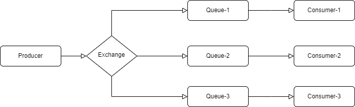

## 1) Install :  Erlang/OTP
	Download Link:      https://www.erlang.org/downloads#source

## 2) Install RABBIT MQ
	Download Link:          https://rabbitmq-website.pages.dev/docs/install-windows#downloads

## 3) ENV Configuration: 
	System Environment Variable Name:   ERLANG_HOME
	Path			                    C:\Program Files\Erlang OTP

	System Environment Variable Name:   RABBITMQ_SERVER
	Path			                    C:\Program Files\RabbitMQ Server\rabbitmq_server-3.13.0

	UNV Path:                          %RABBITMQ_SERVER%\sbin

## 4) RABBIT MQ Admin Login 
    http://localhost:15672/
    RABBIT MQ  Username: guest
        Password:  guest

## References:
    https://www.rabbitmq.com/docs/install-windows-manual#set-erlang-home-variable

## RABBIT MQ Flow Chart

## Sudo Code:
    For Sender:
        Step-1: Connection to RabbitMQ Server ( hostname, port, username,  password)
        Step-2: Exchange Declare (exchange name, 'direct', false, false, false)
        Step-3: Queue Declare (queue name, false, true, false, false)
        Step-4: Queue Bind ( queue name, exchange name )
        Step-5: Publish Message (message body, exchange name, routing key)
        Step-6: Connection close

    For Receiver:
        Step-1: Connection to RabbitMQ Server ( hostname, port, username,  password)
        Step-2: Exchange Declare (exchange name, 'direct', false, false, false)
        Step-3: Queue Declare (queue name, false, true, false, false)
        Step-4: Queue Bind ( queue name, exchange name, routing Key )
        Step-5: Consume Message (queue name, '', false, true, false, false, callback)
        Step-6: Connection close

## Code Practice: Send.php
`
    <?php

    require_once __DIR__ . '/vendor/autoload.php';
    use PhpAmqpLib\Connection\AMQPStreamConnection;
    use PhpAmqpLib\Message\AMQPMessage;

    $connection = new AMQPStreamConnection('localhost', 5672, 'guest', 'guest');
    $channel = $connection->channel();

    $exchangeName = 'my_exchange_1';
    $queueName = 'my_queue_1';
    $routingKey = 'routing_key_1';

    // Declare the exchange and queue
    $channel->exchange_declare($exchangeName, 'direct', false, false, false);
    $channel->queue_declare($queueName, false, true, false, false);
    $channel->queue_bind($queueName, $exchangeName);

    // Send a message to the exchange
    $messageBody = 'Hello, RabbitMQ!';
    $message = new AMQPMessage($messageBody);
    $channel->basic_publish($message, $exchangeName, $routingKey);

    echo " [x] Sent message: '$messageBody'\n";
` 

## Code Practice: receive.php
`
    <?php

    require_once __DIR__ . '/vendor/autoload.php';
    use PhpAmqpLib\Connection\AMQPStreamConnection;

    $connection = new AMQPStreamConnection('localhost', 5672, 'guest', 'guest');
    $channel = $connection->channel();

    $exchangeName = 'my_exchange_1';
    $queueName = 'my_queue_1';
    $routingKey = 'routing_key_1';

    // Declare the exchange and queue
    $channel->exchange_declare($exchangeName, 'direct', false, false, false);
    $channel->queue_declare($queueName, false, true, false, false);
    $channel->queue_bind($queueName, $exchangeName, $routingKey);

    // Callback function to process received messages
    $callback = function ($msg) {
        echo 'MSG: ', $msg->body, "\n";
    };
    
    $channel->basic_consume($queueName, '', false, true, false, false, $callback);

    try {
        $channel->consume();
    } catch (\Throwable $exception) {
        echo $exception->getMessage();
    }

    $channel->close();
    $connection->close();
`

